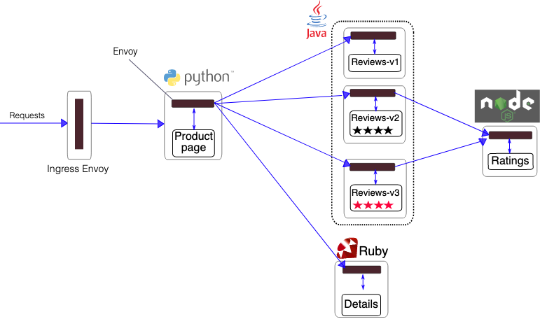
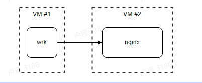

# 采集器性能测试报告（应用性能监控） - {{ data.version }}
## 摘要
本文档为采集器（deepflow-agent）应用性能监控部分的性能测试报告，测试版本为 {{ data.version }}，测试完成时间为{{ data.datetime }}。

## 应用性能监控
本章评估社区版 Agent 在应用性能监控场景下的自身资源消耗，以及对被监控服务的影响。
测试过程中 Agent 开启了如下功能：
- 应用指标（cBPF + eBPF，1m + 1s）
- 应用调用日志（cBPF + eBPF）
- 系统事件（eBPF File IO）
- 网络指标（cBPF，1m + 1s）
- 网络流日志（cBPF）
未开启如下功能：
- TCP 时序图
- PCAP 下载
- 流量分发
DeepFlow 对通过 cBPF 采集 Packet Data 获取网络和应用的指标和日志，通过 eBPF 采集 Socket Data 获取应用和文件 IO 的指标和日志。关于 eBPF、cBPF 采集位置的示意图如下：

在 {{ data.version }} 中，DeepFlow Agent 开启的 eBPF Probe 列表可参考DeepFlow GitHub Repo 中的文档。

### 测试环境
- 虚拟机内核：{{ data.vm_kernal }}
- 虚拟机规格：{{ data.vm_cpu }}{{ data.vm_mem }}
- 采集器限制：{{ data.agent_limit_cpu }}{{ data.agent_limit_mem }}
- 采集器commitId：{{ data.commit_id }}

### 典型云原生微服务场景（istio-bookinfo-demo）
#### 测试方法
这一节我们希望测试典型云原生微服务业务场景下 deepflow-agent 的性能表现。我们找到了 Istio Bookinfo Demo。Istio 是一种流行的服务网格解决方案，在 GitHub 上拥有 32.9K Star。这个 Demo 的应用拓扑见下图，我们可以看到它由 Python、Java、Ruby、Node.JS 实现的四个微服务组成，每个微服务所在的 Pod 中运行着 Envoy 代理。这个 Demo 中的一个事务对应着访问 4 个微服务的 4 个调用，由于 Envoy 的存在实际调用链深度会被延长约两倍。
我们使用 wrk2 来注入稳定的 QPS 负载，wrk2 会直接请求 Productpage 服务。所有的服务（包括 wrk2）部署在一个 8C16GB 的 K8s 节点上（CentOS 7、Kernel 4.19），我们会在该节点上部署 deepflow-agent Daemonset 来对所有调用进行采集，测试过程中限制了 deepflow-agent 资源消耗为 1C768MB。
为了使得 Bookinfo 能够承受 50+% CPU 的高负载，我们调整了两个瓶颈服务的副本数：将 Productpage 调整为 4 副本、将 Details 调整为 2 副本。

具体的 wrk2 测试命令：
- wrk2 -c50 -t4 -R$rate -d60 -L http://$productpage_ip:9080/productpage
#### 详细数据
无采集器运行时的测试数据（基线）：
| 期望QPS | 实际 QPS | P50 时延(us) | P90 时延(us) | productpage CPU | details CPU | reviews CPU | ratings CPU | Envoy CPU |
| --- | --- | --- | --- | --- | --- | --- | --- | --- |
| {{ data.performance_analysis_istio_without_agent.agent.rate[0] }} | {{ data.performance_analysis_istio_without_agent.agent.req_per_sec[0] }} | {{ data.performance_analysis_istio_without_agent.agent.lantency_p50[0] }} | {{ data.performance_analysis_istio_without_agent.agent.lantency_p90[0] }} | {{ data.performance_analysis_istio_without_agent.productpage.max_cpu[0] }} | {{ data.performance_analysis_istio_without_agent.details.max_cpu[0] }} | {{ data.performance_analysis_istio_without_agent.reviews.max_cpu[0] }} | {{ data.performance_analysis_istio_without_agent.ratings.max_cpu[0] }} | {{ data.performance_analysis_istio_without_agent.envoy.max_cpu[0] }} |
| {{ data.performance_analysis_istio_without_agent.agent.rate[1] }} | {{ data.performance_analysis_istio_without_agent.agent.req_per_sec[1] }} | {{ data.performance_analysis_istio_without_agent.agent.lantency_p50[1] }} | {{ data.performance_analysis_istio_without_agent.agent.lantency_p90[1] }} | {{ data.performance_analysis_istio_without_agent.productpage.max_cpu[1] }} | {{ data.performance_analysis_istio_without_agent.details.max_cpu[1] }} | {{ data.performance_analysis_istio_without_agent.reviews.max_cpu[1] }} | {{ data.performance_analysis_istio_without_agent.ratings.max_cpu[1] }} | {{ data.performance_analysis_istio_without_agent.envoy.max_cpu[1] }} |
| {{ data.performance_analysis_istio_without_agent.agent.rate[2] }} | {{ data.performance_analysis_istio_without_agent.agent.req_per_sec[2] }} | {{ data.performance_analysis_istio_without_agent.agent.lantency_p50[2] }} | {{ data.performance_analysis_istio_without_agent.agent.lantency_p90[2] }} | {{ data.performance_analysis_istio_without_agent.productpage.max_cpu[2] }} | {{ data.performance_analysis_istio_without_agent.details.max_cpu[2] }} | {{ data.performance_analysis_istio_without_agent.reviews.max_cpu[2] }} | {{ data.performance_analysis_istio_without_agent.ratings.max_cpu[2] }} | {{ data.performance_analysis_istio_without_agent.envoy.max_cpu[2] }} |
| {{ data.performance_analysis_istio_without_agent.agent.rate[3] }} | {{ data.performance_analysis_istio_without_agent.agent.req_per_sec[3] }} | {{ data.performance_analysis_istio_without_agent.agent.lantency_p50[3] }} | {{ data.performance_analysis_istio_without_agent.agent.lantency_p90[3] }} | {{ data.performance_analysis_istio_without_agent.productpage.max_cpu[3] }} | {{ data.performance_analysis_istio_without_agent.details.max_cpu[3] }} | {{ data.performance_analysis_istio_without_agent.reviews.max_cpu[3] }} | {{ data.performance_analysis_istio_without_agent.ratings.max_cpu[3] }} | {{ data.performance_analysis_istio_without_agent.envoy.max_cpu[3] }} |
| {{ data.performance_analysis_istio_without_agent.agent.rate[4] }} | {{ data.performance_analysis_istio_without_agent.agent.req_per_sec[4] }} | {{ data.performance_analysis_istio_without_agent.agent.lantency_p50[4] }} | {{ data.performance_analysis_istio_without_agent.agent.lantency_p90[4] }} | {{ data.performance_analysis_istio_without_agent.productpage.max_cpu[4] }} | {{ data.performance_analysis_istio_without_agent.details.max_cpu[4] }} | {{ data.performance_analysis_istio_without_agent.reviews.max_cpu[4] }} | {{ data.performance_analysis_istio_without_agent.ratings.max_cpu[4] }} | {{ data.performance_analysis_istio_without_agent.envoy.max_cpu[4] }} |
| {{ data.performance_analysis_istio_without_agent.agent.rate[5] }} | {{ data.performance_analysis_istio_without_agent.agent.req_per_sec[5] }} | {{ data.performance_analysis_istio_without_agent.agent.lantency_p50[5] }} | {{ data.performance_analysis_istio_without_agent.agent.lantency_p90[5] }} | {{ data.performance_analysis_istio_without_agent.productpage.max_cpu[5] }} | {{ data.performance_analysis_istio_without_agent.details.max_cpu[5] }} | {{ data.performance_analysis_istio_without_agent.reviews.max_cpu[5] }} | {{ data.performance_analysis_istio_without_agent.ratings.max_cpu[5] }} | {{ data.performance_analysis_istio_without_agent.envoy.max_cpu[5] }} |
| {{ data.performance_analysis_istio_without_agent.agent.rate[6] }} | {{ data.performance_analysis_istio_without_agent.agent.req_per_sec[6] }} | {{ data.performance_analysis_istio_without_agent.agent.lantency_p50[6] }} | {{ data.performance_analysis_istio_without_agent.agent.lantency_p90[6] }} | {{ data.performance_analysis_istio_without_agent.productpage.max_cpu[6] }} | {{ data.performance_analysis_istio_without_agent.details.max_cpu[6] }} | {{ data.performance_analysis_istio_without_agent.reviews.max_cpu[6] }} | {{ data.performance_analysis_istio_without_agent.ratings.max_cpu[6] }} | {{ data.performance_analysis_istio_without_agent.envoy.max_cpu[6] }} |
| {{ data.performance_analysis_istio_without_agent.agent.rate[7] }} | {{ data.performance_analysis_istio_without_agent.agent.req_per_sec[7] }} | {{ data.performance_analysis_istio_without_agent.agent.lantency_p50[7] }} | {{ data.performance_analysis_istio_without_agent.agent.lantency_p90[7] }} | {{ data.performance_analysis_istio_without_agent.productpage.max_cpu[7] }} | {{ data.performance_analysis_istio_without_agent.details.max_cpu[7] }} | {{ data.performance_analysis_istio_without_agent.reviews.max_cpu[7] }} | {{ data.performance_analysis_istio_without_agent.ratings.max_cpu[7] }} | {{ data.performance_analysis_istio_without_agent.envoy.max_cpu[7] }} |

有采集器运行时的测试数据：

| 期望QPS | 实际QPS | P50 时延 (us) | P90 时延 (us) | productpage CPU | details CPU | reviews CPU | ratings CPU | Envoy CPU | Agent CPU | Agent 内存(byte) |
| --- | --- | --- | --- | --- | --- | --- | --- | --- | --- | --- |
| {{ data.performance_analysis_istio_with_agent.agent.rate[0] }} | {{ data.performance_analysis_istio_with_agent.agent.req_per_sec[0] }} | {{ data.performance_analysis_istio_with_agent.agent.lantency_p50[0] }} | {{ data.performance_analysis_istio_with_agent.agent.lantency_p90[0] }} | {{ data.performance_analysis_istio_with_agent.productpage.max_cpu[0] }} | {{ data.performance_analysis_istio_with_agent.details.max_cpu[0] }} | {{ data.performance_analysis_istio_with_agent.reviews.max_cpu[0] }} | {{ data.performance_analysis_istio_with_agent.ratings.max_cpu[0] }} | {{ data.performance_analysis_istio_with_agent.envoy.max_cpu[0] }} | {{ data.performance_analysis_istio_with_agent.agent.max_cpu[0] }} | {{ data.performance_analysis_istio_with_agent.agent.max_mem[0] }} |
| {{ data.performance_analysis_istio_with_agent.agent.rate[1] }} | {{ data.performance_analysis_istio_with_agent.agent.req_per_sec[1] }} | {{ data.performance_analysis_istio_with_agent.agent.lantency_p50[1] }} | {{ data.performance_analysis_istio_with_agent.agent.lantency_p90[1] }} | {{ data.performance_analysis_istio_with_agent.productpage.max_cpu[1] }} | {{ data.performance_analysis_istio_with_agent.details.max_cpu[1] }} | {{ data.performance_analysis_istio_with_agent.reviews.max_cpu[1] }} | {{ data.performance_analysis_istio_with_agent.ratings.max_cpu[1] }} | {{ data.performance_analysis_istio_with_agent.envoy.max_cpu[1] }} | {{ data.performance_analysis_istio_with_agent.agent.max_cpu[1] }} | {{ data.performance_analysis_istio_with_agent.agent.max_mem[1] }} |
| {{ data.performance_analysis_istio_with_agent.agent.rate[2] }} | {{ data.performance_analysis_istio_with_agent.agent.req_per_sec[2] }} | {{ data.performance_analysis_istio_with_agent.agent.lantency_p50[2] }} | {{ data.performance_analysis_istio_with_agent.agent.lantency_p90[2] }} | {{ data.performance_analysis_istio_with_agent.productpage.max_cpu[2] }} | {{ data.performance_analysis_istio_with_agent.details.max_cpu[2] }} | {{ data.performance_analysis_istio_with_agent.reviews.max_cpu[2] }} | {{ data.performance_analysis_istio_with_agent.ratings.max_cpu[2] }} | {{ data.performance_analysis_istio_with_agent.envoy.max_cpu[2] }} | {{ data.performance_analysis_istio_with_agent.agent.max_cpu[2] }} | {{ data.performance_analysis_istio_with_agent.agent.max_mem[2] }} |
| {{ data.performance_analysis_istio_with_agent.agent.rate[3] }} | {{ data.performance_analysis_istio_with_agent.agent.req_per_sec[3] }} | {{ data.performance_analysis_istio_with_agent.agent.lantency_p50[3] }} | {{ data.performance_analysis_istio_with_agent.agent.lantency_p90[3] }} | {{ data.performance_analysis_istio_with_agent.productpage.max_cpu[3] }} | {{ data.performance_analysis_istio_with_agent.details.max_cpu[3] }} | {{ data.performance_analysis_istio_with_agent.reviews.max_cpu[3] }} | {{ data.performance_analysis_istio_with_agent.ratings.max_cpu[3] }} | {{ data.performance_analysis_istio_with_agent.envoy.max_cpu[3] }} | {{ data.performance_analysis_istio_with_agent.agent.max_cpu[3] }} | {{ data.performance_analysis_istio_with_agent.agent.max_mem[3] }} |
| {{ data.performance_analysis_istio_with_agent.agent.rate[4] }} | {{ data.performance_analysis_istio_with_agent.agent.req_per_sec[4] }} | {{ data.performance_analysis_istio_with_agent.agent.lantency_p50[4] }} | {{ data.performance_analysis_istio_with_agent.agent.lantency_p90[4] }} | {{ data.performance_analysis_istio_with_agent.productpage.max_cpu[4] }} | {{ data.performance_analysis_istio_with_agent.details.max_cpu[4] }} | {{ data.performance_analysis_istio_with_agent.reviews.max_cpu[4] }} | {{ data.performance_analysis_istio_with_agent.ratings.max_cpu[4] }} | {{ data.performance_analysis_istio_with_agent.envoy.max_cpu[4] }} | {{ data.performance_analysis_istio_with_agent.agent.max_cpu[4] }} | {{ data.performance_analysis_istio_with_agent.agent.max_mem[4] }} |

### 极端高性能的业务场景（nginx-default-page）
#### 测试方法
这一节我们希望测试一个极端高性能（极简业务逻辑、极低资源开销）的业务场景下 deepflow-agent 的性能表现。我们选择了 Nginx，我们知道它以性能强悍著称，它用 C 语言实现，而且我们在此 Demo 中让他只是简单的回复一个默认静态页。我们相信这个 Nginx Demo 的性能表现远超过任何一个实际的生产业务，我们希望使用这个 Demo 来说明两个问题：1）deepflow-agent 的采集性能如何；deepflow-agent 的采集对极端高性能业务的影响如何。
我们使用 wrk2 来注入稳定的 QPS 负载，wrk2 会直接请求 Nginx 提供的 Default Page 服务。为了减少其他业务的干扰，我们将 Nginx 和 wrk2 部署在两个单独的虚拟机上（8C16GB、CentOS 7、Kernel 4.19），并且在 Nginx 所在虚拟机上部署了 deepflow-agent。测试过程中限制了 deepflow-agent 资源消耗为 1C768MB。

具体的 wrk2 测试命令：
- wrk2 -c1 -t1 -R$rate -d60 -L http://$nginx_ip:80/index.html
#### 详细数据
无采集器运行时的测试数据（基线）：
| 期望 QPS | 实际 QPS | P50 时延 | P90 时延 | Nginx CPU |
| --- | --- | --- | --- | --- |
| {{ data.performance_analysis_nginx_http_without_agent.agent.rate[0] }} | {{ data.performance_analysis_nginx_http_without_agent.agent.req_per_sec[0] }} | {{ data.performance_analysis_nginx_http_without_agent.agent.lantency_p50[0] }} | {{ data.performance_analysis_nginx_http_without_agent.agent.lantency_p90[0] }} | {{ data.performance_analysis_nginx_http_without_agent.nginx_http.max_cpu[0] }} |
| {{ data.performance_analysis_nginx_http_without_agent.agent.rate[1] }} | {{ data.performance_analysis_nginx_http_without_agent.agent.req_per_sec[1] }} | {{ data.performance_analysis_nginx_http_without_agent.agent.lantency_p50[1] }} | {{ data.performance_analysis_nginx_http_without_agent.agent.lantency_p90[1] }} | {{ data.performance_analysis_nginx_http_without_agent.nginx_http.max_cpu[1] }} |
| {{ data.performance_analysis_nginx_http_without_agent.agent.rate[2] }} | {{ data.performance_analysis_nginx_http_without_agent.agent.req_per_sec[2] }} | {{ data.performance_analysis_nginx_http_without_agent.agent.lantency_p50[2] }} | {{ data.performance_analysis_nginx_http_without_agent.agent.lantency_p90[2] }} | {{ data.performance_analysis_nginx_http_without_agent.nginx_http.max_cpu[2] }} |
| {{ data.performance_analysis_nginx_http_without_agent.agent.rate[3] }} | {{ data.performance_analysis_nginx_http_without_agent.agent.req_per_sec[3] }} | {{ data.performance_analysis_nginx_http_without_agent.agent.lantency_p50[3] }} | {{ data.performance_analysis_nginx_http_without_agent.agent.lantency_p90[3] }} | {{ data.performance_analysis_nginx_http_without_agent.nginx_http.max_cpu[3] }} |
| {{ data.performance_analysis_nginx_http_without_agent.agent.rate[4] }} | {{ data.performance_analysis_nginx_http_without_agent.agent.req_per_sec[4] }} | {{ data.performance_analysis_nginx_http_without_agent.agent.lantency_p50[4] }} | {{ data.performance_analysis_nginx_http_without_agent.agent.lantency_p90[4] }} | {{ data.performance_analysis_nginx_http_without_agent.nginx_http.max_cpu[4] }} |
| {{ data.performance_analysis_nginx_http_without_agent.agent.rate[5] }} | {{ data.performance_analysis_nginx_http_without_agent.agent.req_per_sec[5] }} | {{ data.performance_analysis_nginx_http_without_agent.agent.lantency_p50[5] }} | {{ data.performance_analysis_nginx_http_without_agent.agent.lantency_p90[5] }} | {{ data.performance_analysis_nginx_http_without_agent.nginx_http.max_cpu[5] }} |
| {{ data.performance_analysis_nginx_http_without_agent.agent.rate[6] }} | {{ data.performance_analysis_nginx_http_without_agent.agent.req_per_sec[6] }} | {{ data.performance_analysis_nginx_http_without_agent.agent.lantency_p50[6] }} | {{ data.performance_analysis_nginx_http_without_agent.agent.lantency_p90[6] }} | {{ data.performance_analysis_nginx_http_without_agent.nginx_http.max_cpu[6] }} |

有采集器运行时的测试数据：
| 期望 QPS | 实际 QPS | P50 时延 | P90 时延 | Nginx CPU | Agent CPU | Agent 内存 |
| --- | --- | --- | --- | --- | --- | --- |
| {{ data.performance_analysis_nginx_http_with_agent.server.rate[0] }} | {{ data.performance_analysis_nginx_http_with_agent.server.rps[0] }} | {{ data.performance_analysis_nginx_http_with_agent.server.lantency_p50[0] }} | {{ data.performance_analysis_nginx_http_with_agent.server.lantency_p90[0] }} | {{ data.performance_analysis_nginx_http_with_agent.nginx.max_cpu[0] }} | {{ data.performance_analysis_nginx_http_with_agent.agent.max_cpu[0] }} | {{ data.performance_analysis_nginx_http_with_agent.agent.max_mem[0] }} |
| {{ data.performance_analysis_nginx_http_with_agent.server.rate[1] }} | {{ data.performance_analysis_nginx_http_with_agent.server.rps[1] }} | {{ data.performance_analysis_nginx_http_with_agent.server.lantency_p50[1] }} | {{ data.performance_analysis_nginx_http_with_agent.server.lantency_p90[1] }} | {{ data.performance_analysis_nginx_http_with_agent.nginx.max_cpu[1] }} | {{ data.performance_analysis_nginx_http_with_agent.agent.max_cpu[1] }} | {{ data.performance_analysis_nginx_http_with_agent.agent.max_mem[1] }} |
| {{ data.performance_analysis_nginx_http_with_agent.server.rate[2] }} | {{ data.performance_analysis_nginx_http_with_agent.server.rps[2] }} | {{ data.performance_analysis_nginx_http_with_agent.server.lantency_p50[2] }} | {{ data.performance_analysis_nginx_http_with_agent.server.lantency_p90[2] }} | {{ data.performance_analysis_nginx_http_with_agent.nginx.max_cpu[2] }} | {{ data.performance_analysis_nginx_http_with_agent.agent.max_cpu[2] }} | {{ data.performance_analysis_nginx_http_with_agent.agent.max_mem[2] }} |
| {{ data.performance_analysis_nginx_http_with_agent.server.rate[3] }} | {{ data.performance_analysis_nginx_http_with_agent.server.rps[3] }} | {{ data.performance_analysis_nginx_http_with_agent.server.lantency_p50[3] }} | {{ data.performance_analysis_nginx_http_with_agent.server.lantency_p90[3] }} | {{ data.performance_analysis_nginx_http_with_agent.nginx.max_cpu[3] }} | {{ data.performance_analysis_nginx_http_with_agent.agent.max_cpu[3] }} | {{ data.performance_analysis_nginx_http_with_agent.agent.max_mem[3] }} |
| {{ data.performance_analysis_nginx_http_with_agent.server.rate[4] }} | {{ data.performance_analysis_nginx_http_with_agent.server.rps[4] }} | {{ data.performance_analysis_nginx_http_with_agent.server.lantency_p50[4] }} | {{ data.performance_analysis_nginx_http_with_agent.server.lantency_p90[4] }} | {{ data.performance_analysis_nginx_http_with_agent.nginx.max_cpu[4] }} | {{ data.performance_analysis_nginx_http_with_agent.agent.max_cpu[4] }} | {{ data.performance_analysis_nginx_http_with_agent.agent.max_mem[4] }} |

